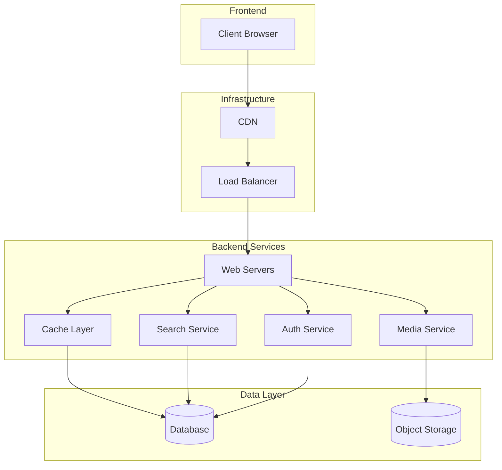
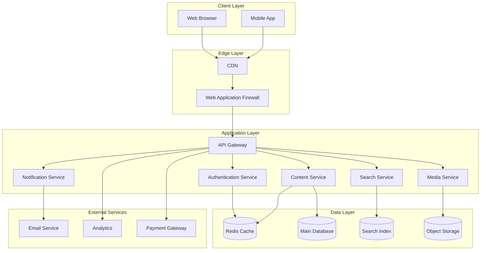
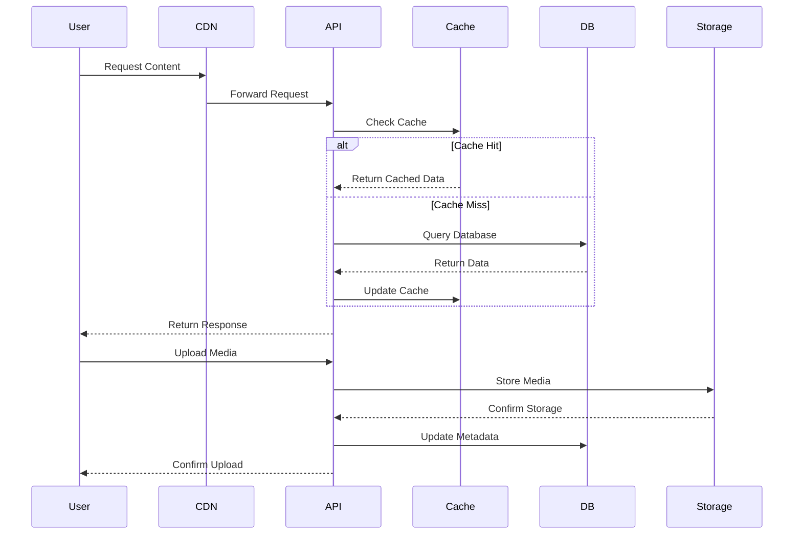
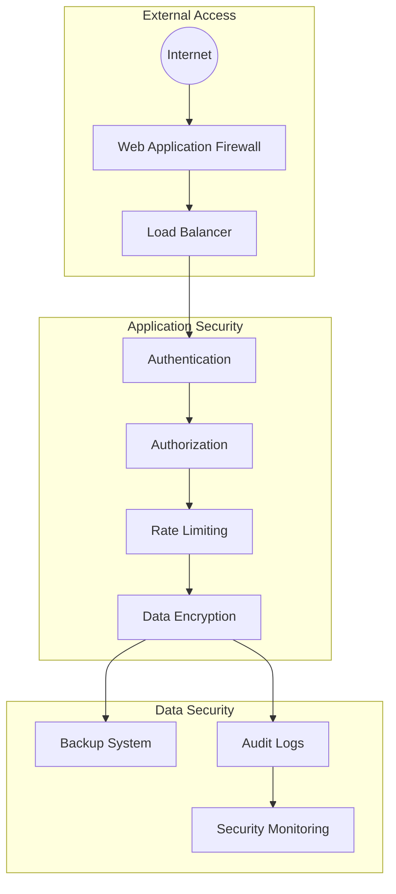
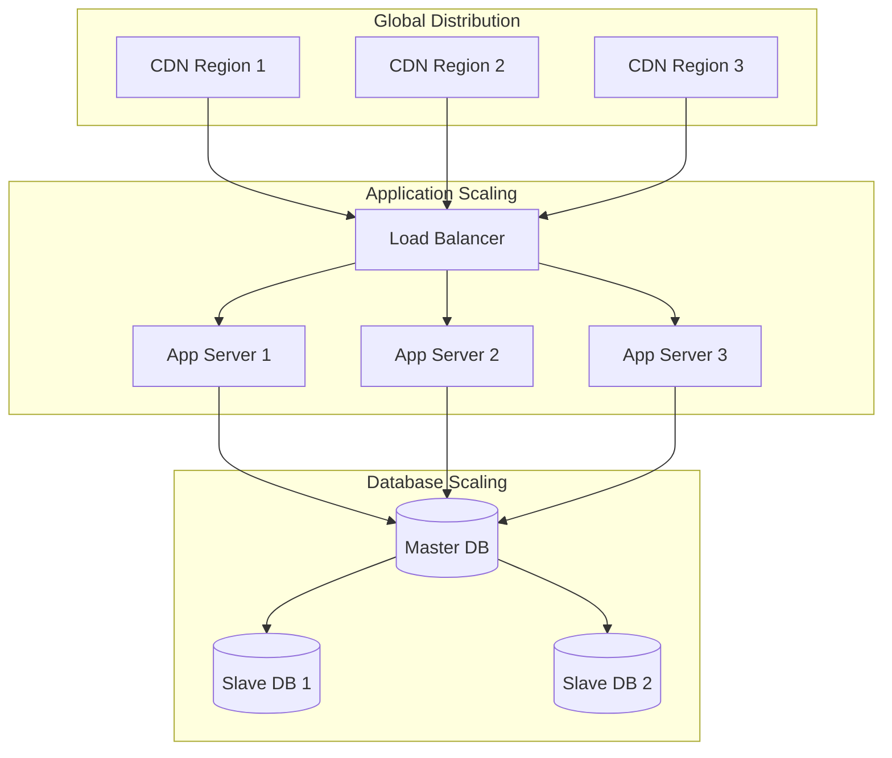

# System Architecture Interview Preparation Guide

// ... existing code ...

## Example: Blogging Site Architecture Questions

### 1. Content Management
- What types of content will be supported?
  - Blog posts
  - Comments
  - Media (images, videos)
  - Categories/Tags
- What are the content creation workflows?
- Will there be multiple authors?
- What are the content moderation requirements?
- Will there be scheduled publishing?

### 2. User Management
- What types of users will the system support?
  - Readers
  - Authors
  - Administrators
  - Moderators
- What authentication methods are needed?
- What are the user permission levels?
- Will there be user profiles?
- Will there be social features (following, likes)?

### 3. Content Delivery
- What is the expected read-to-write ratio?
- What are the peak traffic patterns?
- What is the expected content size?
- Will there be real-time features?
  - Live comments
  - Notifications
  - Analytics

### 4. Search and Discovery
- What search capabilities are needed?
  - Full-text search
  - Tag-based search
  - Category filtering
- What are the search performance requirements?
- Will there be recommendation features?
- How will content be organized?

### 5. Media Handling
- What types of media will be supported?
- What are the media storage requirements?
- Will there be media processing needs?
  - Image resizing
  - Video transcoding
  - Thumbnail generation
- What are the media delivery requirements?

### 6. Performance Requirements
- What is the expected number of:
  - Daily active users
  - Concurrent users
  - Page views per day
  - Content updates per day
- What are the response time requirements?
- What are the availability requirements?

### 7. Data Management
- What is the expected data growth rate?
- What are the data retention requirements?
- What are the backup requirements?
- What are the data consistency requirements?

### 8. Integration Requirements
- Will there be social media integration?
- Will there be analytics integration?
- Will there be email notification system?
- Will there be third-party authentication?

### 9. Monetization
- Will there be advertising?
- Will there be premium content?
- Will there be subscription features?
- What are the payment processing requirements?

### 10. SEO and Analytics
- What SEO requirements are needed?
- What analytics data needs to be collected?
- What are the reporting requirements?
- What are the tracking requirements?

### 11. Security Requirements
- What are the content protection needs?
- What are the user data protection requirements?
- What are the anti-spam requirements?
- What are the backup and recovery requirements?

### 12. Mobile Requirements
- Will there be a mobile app?
- What are the responsive design requirements?
- What are the mobile-specific features?
- What are the offline capabilities?

### 13. Internationalization
- Will the site support multiple languages?
- What are the localization requirements?
- What are the regional content requirements?
- What are the timezone handling requirements?

### 14. Compliance
- What are the data privacy requirements?
- What are the content regulation requirements?
- What are the accessibility requirements?
- What are the industry-specific compliance needs?

### 15. Development and Deployment
- What is the expected development timeline?
- What are the deployment frequency requirements?
- What are the testing requirements?
- What are the monitoring requirements?

### Key Technical Considerations for Blogging Site:

1. **Content Delivery Network (CDN)**
   - For static content delivery
   - For media content delivery
   - For global content distribution

2. **Caching Strategy**
   - Page caching
   - Database caching
   - Object caching
   - CDN caching

3. **Database Design**
   - Content storage
   - User data
   - Comments and interactions
   - Analytics data

4. **Search Implementation**
   - Full-text search engine
   - Indexing strategy
   - Search optimization

5. **Media Storage**
   - Cloud storage
   - Media processing
   - Delivery optimization

6. **Scalability Considerations**
   - Horizontal scaling
   - Database sharding
   - Load balancing
   - Caching layers

7. **Security Measures**
   - Authentication
   - Authorization
   - Content protection
   - DDoS protection

8. **Monitoring and Analytics**
   - Performance monitoring
   - User analytics
   - Content analytics
   - Error tracking

Remember to:
- Start with user requirements
- Consider content management needs
- Plan for scalability
- Think about security
- Consider monetization
- Plan for maintenance
- Think about future growth

## Blogging Site Architecture Diagrams

### 1. High-Level Architecture

### 2. Detailed Component Architecture

### 3. Data Flow Architecture

### 4. Security Architecture

### 5. Scalability Architecture

### Key Components Description:

1. **Client Layer**
   - Web browsers
   - Mobile applications
   - Third-party integrations

2. **Edge Layer**
   - CDN for static content
   - WAF for security
   - Load balancing

3. **Application Layer**
   - API Gateway
   - Microservices
   - Authentication
   - Content management
   - Search service
   - Media handling
   - Notifications

4. **Data Layer**
   - Caching (Redis)
   - Main database
   - Search index
   - Object storage

5. **External Services**
   - Email service
   - Analytics
   - Payment processing

### Architecture Considerations:

1. **Scalability**
   - Horizontal scaling of application servers
   - Database replication
   - CDN distribution
   - Caching at multiple levels

2. **Security**
   - WAF protection
   - Authentication/Authorization
   - Data encryption
   - Rate limiting
   - Audit logging

3. **Performance**
   - CDN for static content
   - Caching strategy
   - Database optimization
   - Load balancing

4. **Reliability**
   - High availability
   - Disaster recovery
   - Backup systems
   - Monitoring and alerting

5. **Maintainability**
   - Microservices architecture
   - Clear separation of concerns
   - Modular design
   - Easy deployment

// ... existing code ...